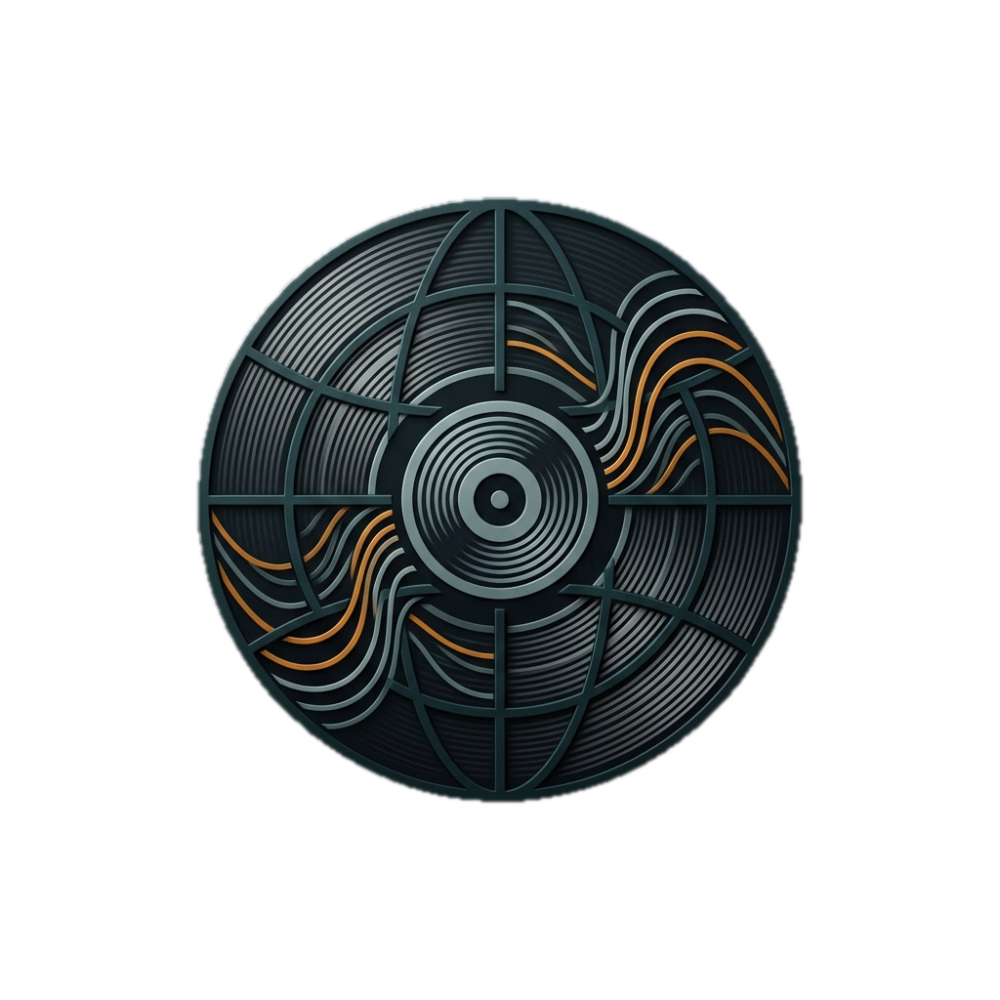
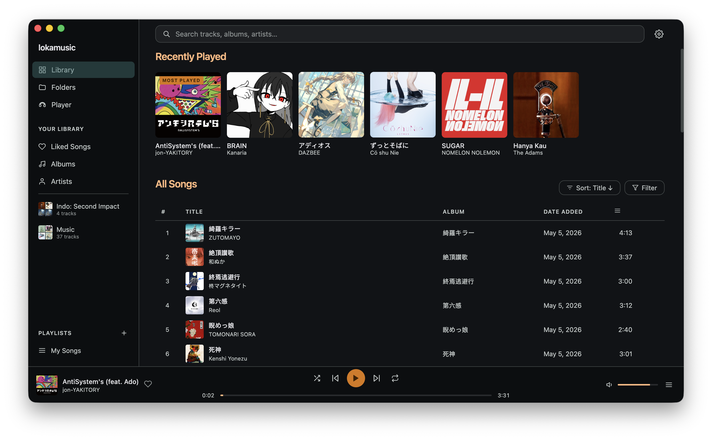
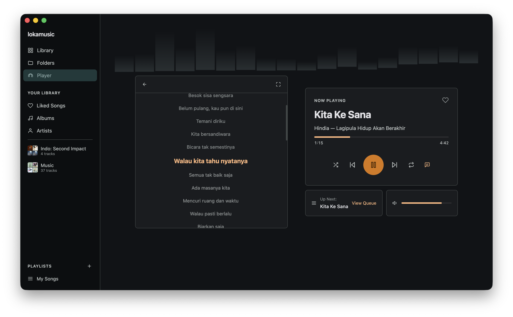

<p align="center">
    
</p>

<h1 align="center">lokamusic</h1>

<p align="center">
    A clean, minimal local music player for desktop.<br>
    Scan your folders, manage your library, and play your music — fully offline.
</p>





---

## What is lokamusic?

lokamusic is a lightweight desktop app for playing your local music collection. No subscriptions, no internet required — just point it at a folder full of music files and lokamusic handles the rest automatically.

---

## Features

### Library & Organization

- **Automatic folder scanning** — Add one or more folders and lokamusic will find every music file inside (including subfolders) and extract metadata automatically.
- **Direct file import** — Pick individual music files to add to your library without setting up a folder.
- **Automatic metadata** — Track title, artist, album, duration, and cover art are read directly from the file tags (ID3, FLAC, etc.) — no manual input needed.
- **Persistent library** — Your library is saved locally and survives app restarts.
- **Library view** — See all your songs in a sortable table with title, artist, album, duration, and date added columns.
- **Albums view** — Browse your collection by album, with cover art and a full track list per album.
- **Artists view** — Browse music grouped by artist.
- **Folders view** — See the source folder structure and directory tree for your watched folders.

### Search & Filter

- **Real-time search** — Type in the search bar to instantly filter songs by title, artist, or album.
- **Column sorting** — Sort your library by title, artist, album, date added, or duration — ascending or descending.
- **Liked filter** — Show only the songs you've marked as liked.

### Playback

- **Full playback controls** — Play, pause, skip, previous, seek bar, and volume control.
- **Shuffle** — Randomize the play queue from any song.
- **Repeat** — Three modes: off, repeat one, repeat all.
- **Queue panel** — View and manage the current play queue via a slide-out sidebar panel.
- **Mini player (BottomBar)** — A persistent bottom bar that shows the active song, basic controls, and playback progress on every screen.
- **Full player view** — A dedicated player screen with large cover art, full controls, and song details.

### Personal Collection

- **Liked Songs** — Mark your favorite tracks with the like button; all liked songs are collected on their own dedicated page.
- **Playlists** — Create custom playlists, name them, and add or remove songs at any time.
- **Recently played** — A history of recently played songs is saved automatically.

### Integrations & More

- **Discord Rich Presence** — Show the song you're currently playing in your Discord status in real time, complete with album artwork (fetched from iTunes). Can be toggled on or off from Settings.
- **Auto-updater** — The app checks for updates automatically and can install them in-app — no need to manually download a new version.
- **Dark interface** — Full dark mode with a minimal design, Geist typography, and an "Organic Precision" color palette (teal + amber).

---

## Download

Visit the [Releases](https://github.com/raflidev/lokamusic/releases) page to download the latest version. Available for macOS, Windows, and Linux.

---

## Developer Notes

### Commands

```bash
npm run dev              # start Tauri app in dev mode (Rust + Vite HMR)
npm run build            # production build (Tauri bundle)
npm run dev:renderer     # start Vite renderer only (no Tauri)
npm run build:renderer   # build renderer only
npm run check            # type-check Svelte files
```

### Stack

| Layer | Technology |
|---|---|
| Desktop shell | Tauri 2 |
| UI framework | Svelte 5 (runes) |
| Language | TypeScript 5 + Rust |
| Build tool | Vite 5 + `@sveltejs/vite-plugin-svelte@4` |
| Styling | CSS custom properties (design tokens) |
| Persistence | `tauri-plugin-store` → `config.json` |
| Metadata | Rust `lofty` crate |
| Discord RPC | `discord-rich-presence` crate |
| Font | Geist Variable |

### Important Notes

- **Do not upgrade** `@sveltejs/vite-plugin-svelte` beyond v4 or `vite` beyond v5 — `@sveltejs/vite-plugin-svelte@6` has a bug with the Vite Environment API that causes `.ts` files to be compiled as Svelte.
- Library data is persisted to `~/Library/Application Support/lokamusic/config.json` on macOS.
- Audio playback uses the HTML5 `<audio>` element with native paths converted via `convertFileSrc()` from Tauri.
- Pinned folders are stored in renderer `localStorage` only (not in the Tauri store).
- Discord artwork is cached per `artist::album` key in Rust state to avoid redundant iTunes API calls.
- Design tokens and color system are documented in `DESIGN.md`.
